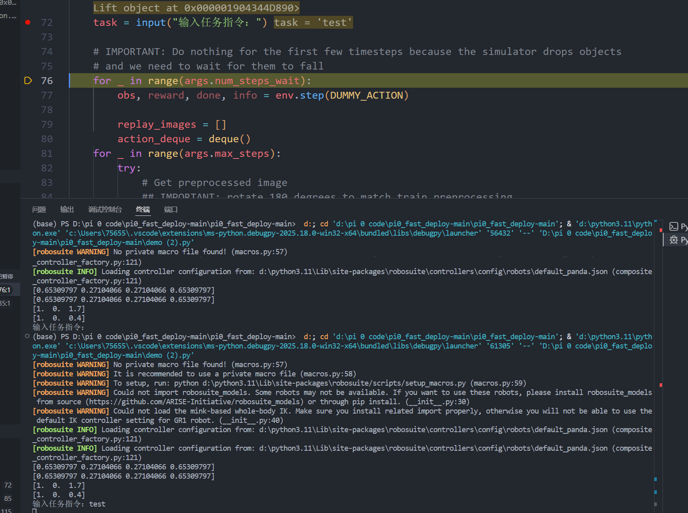
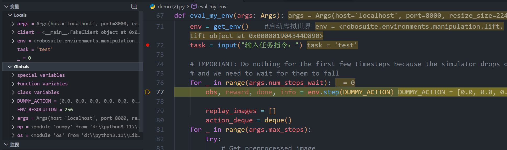
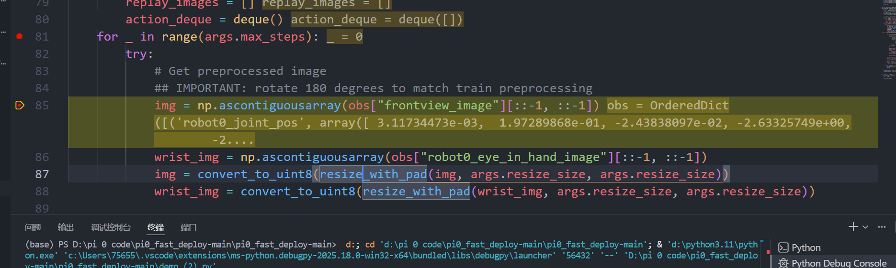
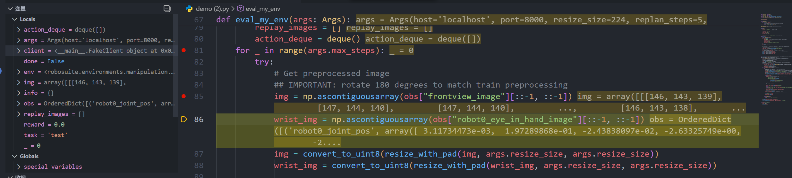
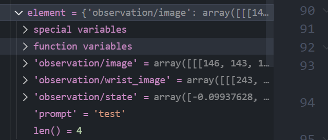
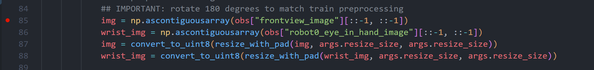
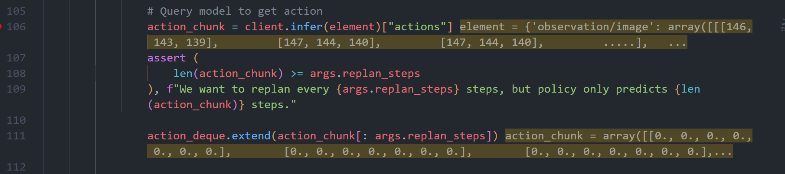

#### 启动调试器

1. 点击 VS Code 左侧边栏的 **“运行和调试”图标**（那只带虫子的播放键）。
    
2. 点击顶部的绿色小三角 **“启动调试 (F5)”**。
    
3. 如果弹出菜单选择调试器，选 **Python Debugger** -> **Python File**。

单步调试用F10，连续调试（配合断点）用F5
调试开始后，程序会停在你打红点的地方，该行底色变黄，停在哪一行，表示程序还没有开始执行这一行。
- **单步跳过 (F10)**：一行行往下走。
- **继续 (F5)**：直接跑到下一个红点。
此时可以查看左侧的变量。左侧的变量分为局部变量（Locals）和全局变量（Globals）。局部变量会显示上一行变量或者这行之前包含在整个函数里面的所有变量。
除变量外，还有一个功能： Watch (监视) —— **“你的私人望远镜”**
这块区域默认通常是空的，或者是你之前手动添加过的东西
**含义**：它是 **高度自定义** 的。你可以把任何你想 **持续追踪** 的变量或表达式填进去，不用去 Locals 里翻来翻去。

在编程调试中，**时间是不能倒流的**。你不能直接“撤销”代码的执行，因为变量的值已经变了，仿真器里的物理状态也变了。如果你想重新看一遍刚才的过程，必须 **重启调试 (Restart)**。

#### ✅ 操作步骤：

本代码设置三个断点，分别为
- task = input("输入任务指令：")
- img = np.ascontiguousarray(obs["frontview_image"][::-1, ::-1])
- obs, reward, done, info = env.step(action.tolist())

如这两张图所示，执行到72行终端并不会显示输入任务指令，需要再点击F10，执行到下一行代码才会显示。

---

如图，执行到77行，左侧局部变量显示的变量都是函数eval_my_env函数里面的变量。（_ 表示的for循环的这个变量）
这里如果进行F10调试的话，会发现第一次执行到80后再点击F10，就会跳转到76行，这是因为for循环的缘故，要执行到要求的循环次数才能跳出for循环。
#### ✅ 怎么快速跳出这个循环？

如果你不想看它跑这剩下的 8、9 圈了，想直接进正题（后面的第 81 行主循环），请这样做：

1. **取消断点**： 用鼠标**再次点击**第 77 行左边那个**小红点**，把它点灭（去掉）。
    
2. **设置新目标**： 在下面的 **第 85 行** (`img = ...`) 左边打一个新的红点。
    
3. **起飞**： 按一下 **F5**。


这里的黄字 obs = OrderedDict([('robot0_joint_pos', array([-1.0600...  
表明obs是一个**有序字典”**（可以把它当成一个超级详细的数据库）- - 后面跟着的 `('robot0_joint_pos', array([-1.06...` 是字典里的第一个数据，记录了 **“机器人关节的位置”**。因为屏幕一行塞不下这么多东西，所以 VS Code 只能 **截取开头的一小段** 显示出来。这就导致你看到的是一堆密密麻麻的数字切片，看起来像乱码。

而代码部分 obs["frontview_image"]   
- 这是字典的 **取值** 语法。
- 就像你查通讯录，你要找“张三”的电话，你得输入名字。
就是在obs这个字典里面取出 frontview_image 这个数据

[::-1, ::-1]   这是 **NumPy 的切片（Slicing）** 魔法，专门用来处理数组的。
- **第一个 `::-1`**：把图片 **上下颠倒**（翻转所有的行）。
    
- **第二个 `::-1`**：把图片 **左右颠倒**（翻转所有的列）。
    
- **合起来**：上下翻 + 左右翻 = **旋转 180 度**。

np.ascontiguousarray(...)
这是一个 **内存整理** 的操作。当我们做上面的“翻转”操作时，NumPy 为了快，并不会真的去内存里把几万个数字重新搬家，而是只改变了“读取的顺序”（给了一个虚拟的视图 View）。**这个函数的作用**： `ascontiguousarray` = **"As Contiguous Array"（转成连续数组）**。
- 它的作用是：**“别光是眼睛倒着看，请把内存里的数据真的重新排一遍序，给我一份整整齐齐的、连续的新拷贝。”**

### 总结流程
这行代码翻译成人话就是：

1. **`obs["frontview_image"]`**：从 `obs` 这个柜子里，把标签为“正面照片”的数据拿出来。
    
2. **`[::-1, ::-1]`**：把这张照片 **上下左右全部颠倒**（旋转180度）。
    
3. **`np.ascontiguousarray(...)`**：把颠倒后的数据 **重新抄写一遍**，存成一张内存整齐的新图片。
    
4. **`img = ...`**：最后把这张处理好的图片，起名叫 `img`。



这里有一细节，就是执行到86行的时候，刚刚前面85行的黄色字体发生了变化，
这是 VS Code 调试器的一个**智能特性**，它展示的是 **“当下最相关的变量”**。

- **当你停在第 85 行还没执行时**：
    
    - 此时等号左边的 `img` 还不存在（还没生出来）。
        
    - 这一行里**唯一存在**且**有值**的东西是等号右边的 `obs`。
        
    - 所以调试器贴心地给你展示 `obs` 的内容，意思是：“看，这是我们要用来做菜的**原材料**。”
        
- **当你执行完，跳到第 86 行时**：
    
    - 第 85 行已经跑完了，`img` 已经生出来了。
        
    - 调试器判断：这一行刚刚算出了 `img`，你肯定最想知道结果对不对。
        
    - 所以它把黄字更新成了 `img` 的内容，意思是：“看，这是刚刚做好的**成品菜**。”


#### 左侧的 img 和右侧黄字 img 是一样的吗？

**答案：完全一样，但是“穿的衣服”不一样。**

它们指的是内存里同一块数据，只是展示的**侧重点**不同：

#### A. 右侧黄字 (Inline Value) —— **“内容预览”**

- **它是啥**：它直接把数组里的**具体数字**打印出来了。
    
- **看截图**：`img = array([[[146, 143, 139]...`
    
    - 这些 `146, 143` 是像素点的颜色值（RGB）。
        
    - **缺点**：因为图片有几万个像素，这行字写不下，所以后面只能用 `...` 省略掉。
        
- **用途**：用来快速瞥一眼数据是不是空的（全0），或者大概是个什么样子的数字。
---
#### B. 左侧变量面板 (Locals) —— **“属性体检单”**

- **它是啥**：它展示的是这个数据的**结构信息**。
    
- **看截图**：
    
    - `dtype = dtype('uint8')`：告诉你这是整数格式（0-255），这是正确的图片格式。
        
    - `min = 7`, `max = 255`：告诉你像素亮度的范围。
        
    - **最关键的**：`shape = (256, 256, 3)`。
        
        - 这告诉你图片的高度是 256，宽度是 256，有 3 个颜色通道（红绿蓝）。
            
- **用途**：这是最专业的查看方式。通常如果代码报错（比如“维度不匹配”），我们第一时间就是来左边看 `shape` 对不对。


左侧的变量中，基本上都会包含 `special variables` (特殊变量) 和 `unction variables` (函数变量)
简单来说，这两个文件夹是 VS Code 调试器帮你做的**分类整理**，为了不让你的变量面板乱成一团。
### `pecial variables` (特殊变量) —— 对象的“身份证”

这里面装的通常是 Python 中的 **“魔法属性” (Magic Attributes)**，也就是那些以双下划线开头和结尾的东西（比如 `__name__`, `__class__`, `__doc__`）。

- **它是啥**：它是这个变量的**内部元数据**。
    
- **比如**：
    
    - `__class__`: 告诉你这个变量是什么类型的（比如 `dict` 还是 `numpy.ndarray`）。
        
    - `__len__`: 告诉你这个变量有多长（当你调用 `len()` 时其实就是在这个抽屉里找答案）。
        
    - `__doc__`: 这个变量的说明文档。
        
- **你要看吗？** **99% 的情况下不用看。** 除非你在写非常底层的框架代码，否则这里面的东西对你的调试没有实际帮助。
---
### 2. `function variables` (函数变量) —— 对象的“工具箱”

这里面装的是这个对象**自带的所有功能（方法/函数）**。

- **它是啥**：它告诉你“这个变量**能做什么**”。
    
- **比如**：
    
    - 如果变量是**字典** (`element`)：打开这个文件夹，你会看到 `keys`, `values`, `items`, `pop` 等函数。因为字典天生就自带这些功能。
        
    - 如果变量是**数组** (`img`)：你会看到 `mean` (求平均), `reshape` (变形), `max` (求最大值) 等函数。
        
- **你要看吗？** **不用看。** 你通常只关心在这个变量里**存了什么数据**，而不是关心它**能干什么**。调试器把它们折叠起来，就是为了防止这些几百个函数刷屏，挡住你真正想看的数据。


这里出现的第一个img是设置变量，第二个img是对图片大小进行改变。通过debug，当执行到86行和88行，对比左侧的img的变量内容，可以发现img的shape值发生变化。

## 第二阶段 了解底层源码

第一行代码： action_chunk = client.infer(element)["actions"]
element就是我们前面在虚拟环境里面收集到的关于机械臂的数据，，把这部分交给 `client.infer` 去处理， 返回的是一个**大字典**（可能包含预测的动作、预测的文本回答等）。我们只关心动作，所以用 `["actions"]` 把这部分数据拿出来。，把这些动作存放到action_chunk里面。

`assert` 是 Python 的断言语句，翻译过来就是：**“我要非常自信地断定这件事是真的，如果不是真的，程序就立刻报错报警，别往下走了！”**

下一步 `action_deque.extend(action_chunk[: args.replan_steps]`  这就是在把动作放到缓存区。
- `action_chunk` 里有 **50 步** 预测动作（你的大脑虽然是假的，但也返回了 50 个全 0 的动作）。
    
- `args.replan_steps` 是 **5**。
    
- 这行代码的意思是：**“虽然你给了我 50 步的建议，但我只采纳前 5 步。”**
**为什么要扔掉后面 45 步？**

- 因为 **“预测得越远，越不准”**。
    
- 就像天气预报，明天的天气很准，半个月后的天气预报基本是瞎猜。机器人控制也是同理，我们只执行最准的前几步，然后马上重新根据新情况再预测，这样机器人走得更稳（这就是所谓的 **Receding Horizon Control**）。

==关键== ： 这里的关键部分就是  `client.infer` 
ctrl 点击 infer 可以知道是通过WebsocketClientPolicy 处理数据

## WebsocketClientPolicy  
这段代码实现了一个**同步的 WebSocket 客户端**，用于将本地的观测数据（Observation）发送到远程服务器，并接收服务器返回的推理结果（Action）。

### 1.`__init__` —— 存电话号码，准备拨号

这一步就像是你要出门办事，先要把对方地址写好，准备好行李箱，然后开始拨通电话。
```python
def __init__(self, host: str = "0.0.0.0", port: Optional[int] = None, api_key: Optional[str] = None) -> None:
    # 1. 拼写对方的地址 (URI)
    # 就像把 "192.168.1.5" 变成 "ws://192.168.1.5" (ws代表Websocket协议)
    self._uri = f"ws://{host}"
    
    # 2. 如果有端口号，也拼上去
    # 变成 "ws://192.168.1.5:8000" (就像具体的门牌号)
    if port is not None:
        self._uri += f":{port}"
    
    # 3. 准备一个“压缩打包机” (Packer)
    # 因为图片数据太大，不能直接发，要用这个工具把它压得实实的才能发出去
    self._packer = msgpack_numpy.Packer()
    
    # 4. 存一下你的身份证 (API Key)，虽然不一定用到
    self._api_key = api_key
    
    # 5. 【关键一步】拿起电话拨号！
    # 这一行会卡住，直到电话打通为止。打通后，保存通话线路 (_ws) 和对方的自我介绍 (_server_metadata)
    self._ws, self._server_metadata = self._wait_for_server()
```
### 2.`_wait_for_server` —— 死缠烂打求接通
这个函数就是上面第 5 步调用的那个“拨号过程”。因为服务器可能还没开机，所以我们要**一直打，直到打通为止**。
```python
def _wait_for_server(self) -> Tuple[websockets.sync.client.ClientConnection, Dict]:
    # 打印一条日志：告诉自己 "我要开始打给 xxx 了"
    logging.info(f"Waiting for server at {self._uri}...")
    
    # 死循环：只要没打通，就一直试，绝不放弃
    while True:
        try:
            # 1. 准备 HTTP 头信息 (就像递交名片)
            # 如果有 API Key 就带上，没有就是 None
            headers = {"Authorization": f"Api-Key {self._api_key}"} if self._api_key else None
            
            # 2. 【核心】尝试拨通电话 (Connect)
            # 如果对方没开机，这里会直接报错，跳到下面的 except 那里
            conn = websockets.sync.client.connect(
                self._uri, compression=None, max_size=None, additional_headers=headers
            )
            
            # 3. 电话通了！听对方的第一句话 (Recv & Unpack)
            # conn.recv() 是听，unpackb 是把听到的“外星语”翻译成字典
            metadata = msgpack_numpy.unpackb(conn.recv())
            
            # 4. 任务完成，把 通话线路(conn) 和 对方信息(metadata) 返回去
            return conn, metadata
            
        except ConnectionRefusedError:
            # 5. 哎呀，被挂断了 (对方没开机，或者端口不对)
            logging.info("Still waiting for server...")
            
            # 6. 别急，休息 5 秒钟再重拨，防止把机器累死
            time.sleep(5)
```
### 3.`infer` —— 寄照片，等指令
这是机器人干活时一直在用的函数。就像是你拍了一张照片，寄给远处的专家，然后坐在门口干等专家寄回来的操作指南。
```python
def infer(self, obs: Dict) -> Dict:
    # 1. 打包 (Packing)
    # obs 是那个巨大的字典（里面有图片矩阵）。
    # 用刚才准备好的“打包机”，把它瞬间压缩成一串二进制乱码 (bytes)，方便运输。
    data = self._packer.pack(obs)
    
    # 2. 发快递 (Send)
    # 顺着刚才打通的那根电话线 (_ws)，把这包数据扔过去。
    # 扔出去之后，数据就飞到显卡服务器那边去了。
    self._ws.send(data)
    
    # 3. 【傻等】等待回信 (Receive)
    # 这一行代码会像被定身术定住一样，卡在这里不动！
    # 必须等到服务器算完了，发回来一个包裹 (response)，程序才会往下走。
    response = self._ws.recv()
    
    # 4. 检查是不是坏消息
    # 如果服务器发回来的不是包裹，而是一张写着字的纸条 (string)，说明出错了（比如报错信息）。
    if isinstance(response, str):
        # 既然出错了，就直接报警 (报错)，停止运行
        raise RuntimeError(f"Error in inference server:\n{response}")
    
    # 5. 拆快递 (Unpacking)
    # 把收到的那个二进制包裹，拆开还原成 Python 能读懂的动作数组 (50步动作)。
    return msgpack_numpy.unpackb(response)
```
**总结一下就是：**

1. **`__init__`**: 准备工作。
    
2. **`_wait_for_server`**: 疯狂拨号，直到接通。
    
3. **`infer`**: 每次干活时，打包发过去，死等结果回来，拆包用。